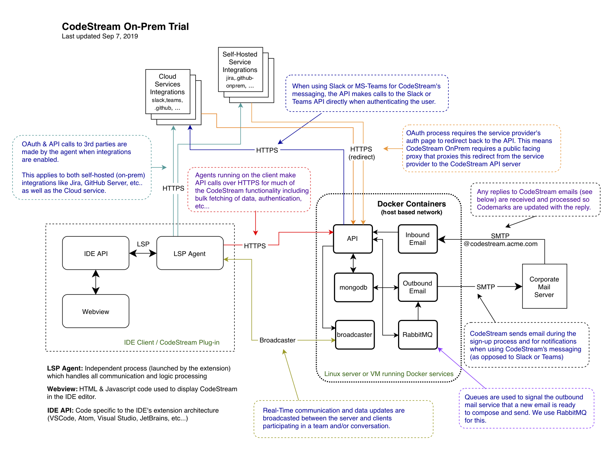

# CodeStream OnPrem

## Overview
**CodeStream OnPrem** is a dcoker-ized version of the CodeStream Cloud services
which you can install and operate entirely on your own hardware (or cloud
service provider). You only need a linux host OS running Docker.

If you intend to configure Slack or MS Teams messaging, or if you plan to
configure any integrations with other cloud service providers (such as Github,
Atlassian, Asana, Trello, Azure DevOps, Bitbucket, Gitlab, etc...) you will need
to provide a public-facing web proxy for OAuth callbacks from those providers.

If you intend to use built-in CodeStream messaging, you will need a mail relay
server or mail submission account that accepts email sent by the **CodeStream
outbound email docker container**.

Simiarly, if you want replies to CodeStream generated emails to flow back into
the system (support for the **CodeStream inbound email gateway**) you will need
to configure mail routing (MX) to the inbound email gateway container for a mail
domain of your choosing dedicated to this task (for example,
**@codestream.my-company.com**).

At this time, **CodeStream OnPrem** is by invitation and only available in a
**single host preview** configuration. Send an email to
[sales@codestream.com](mailto://sales@codestream.com) to get started.

NOTE: The **CodeStream inbound email gateway** is not available at this time.

## Get Started
Once you've been invited by the CodeStream sales team, [click here for
instructions on how to set up a preview environment on a single linux host OS
running Docker.](docs/README.preview-single-host.md) 

## Architecture Diagram

