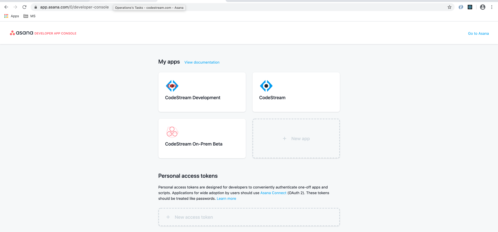
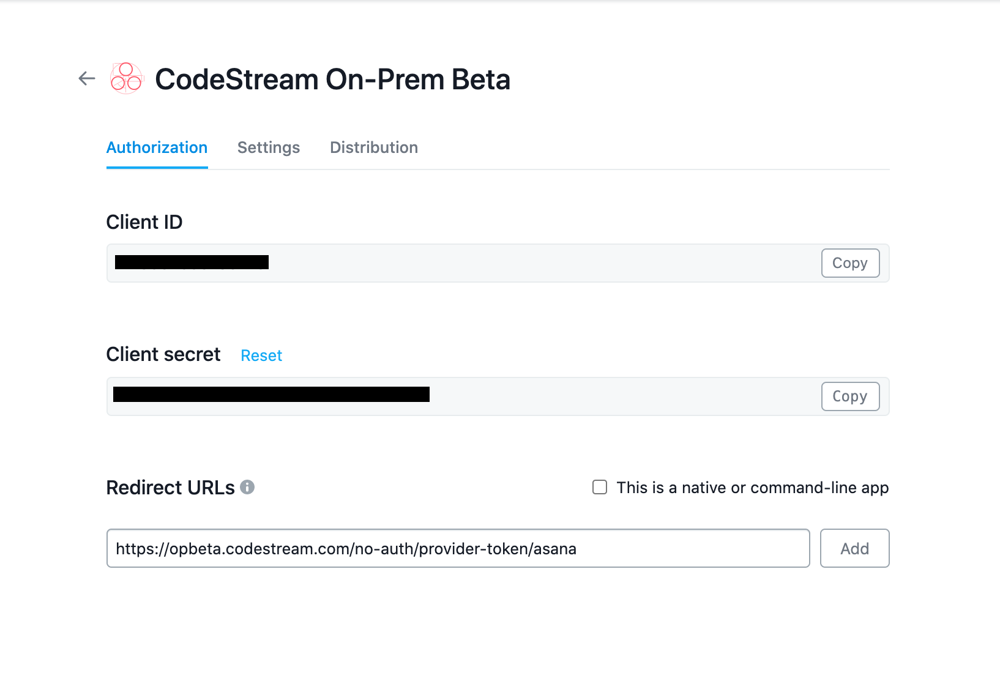

To use Asana's API and perform authentication, you'll need to create an App.
These instructions walk you through that process. [Further documentation on
registering an application can be found
here](https://developers.asana.com/docs/authentication-basics).

For this procedure, you'll need an account on Asana to use as the App owner and
your CodeStream On-Prem API protocol & hostname (eg.
`https://codestream.mycompany.com/`)


## Login to Asana

[The developer console can be found
here](https://app.asana.com/0/developer-console). Use the account under which
you want to create the App that will provide the credentials which CodeStream
will use to make API calls.




## Create the App

Click on **New App** and add your OAuth Redirect URL as follows:
`https://codestream.mycompany.com/no-auth/provider-token/asana` (substitute your
On-Prem server's hostname, but make sure you keep the full path; /no-auth/...).



Make note of the **Client ID** and **Client secret**. You'll need them for the
final step.


## Update the CodeStream Config and Restart

Add the following section to your
**~/.codestream/codestream-services-config.json** file. Make a backup of this
file _before_ you add the new information, just in case something goes wrong
you'll be able to back out your change by putting the backup in place.
```
	"integrations": {
		"asana": {
			"cloud": {
				"appClientId": "-- Client ID goes here --",
				"appClientSecret": "-- Client Secret goes here --"
			}
		},
		...
	},
	...
```

After you make that change, restart CodeStream
```
~/.codestream/codestream --restart
```

Instruct your users to _Reload_ their IDEs. They should now be able to connect
to Asana.
