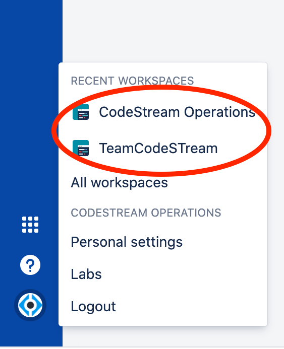
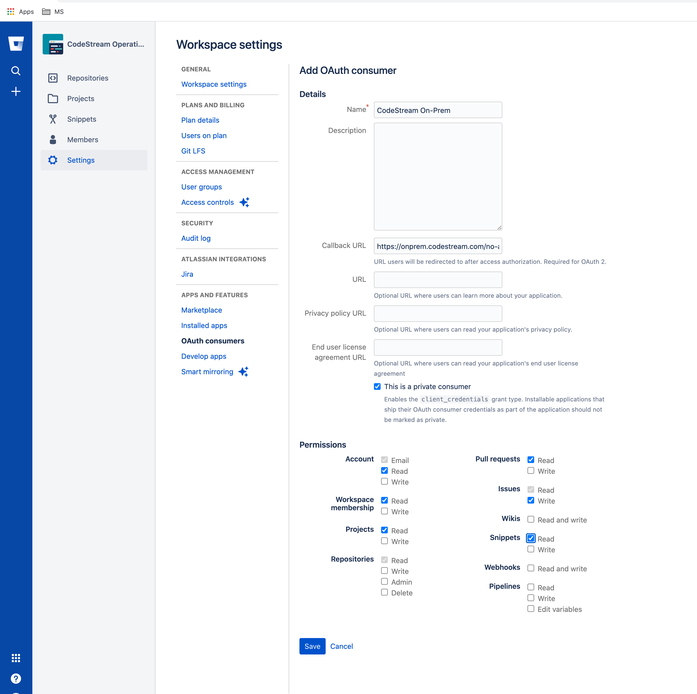
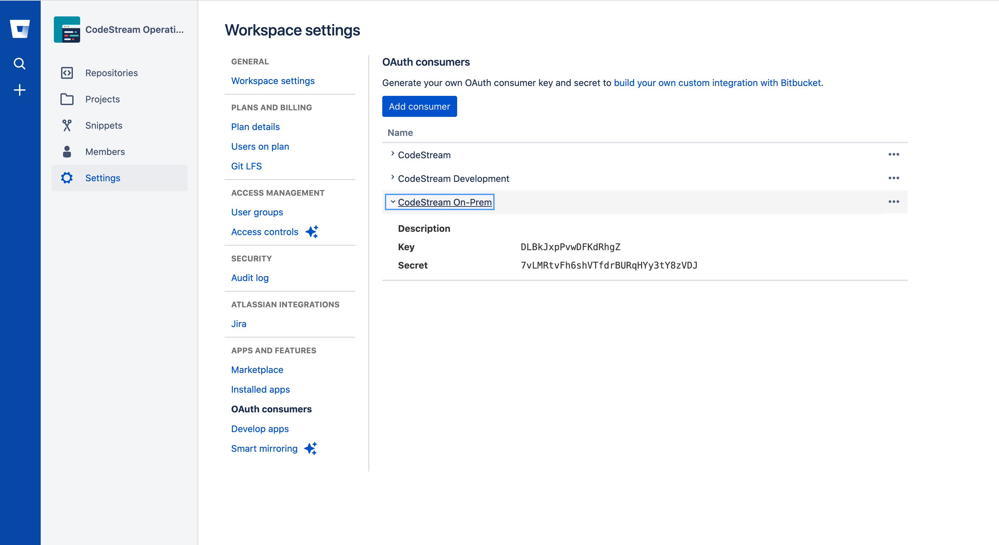

To get the CodeStream BitBucket integration working, you'll need to login to
your Bitbucket account and add an OAuth consumer to the Workspace which holds
your repositories.

## Login to BitBucket and Go to the Workspace Settings Page

[Login to BitBucket](https://bitbucket.org), click on your user icon on the
lower left of the screen and select the Workspace you want to connect to.


<br>
<!--  -->

Navigate to the **Settings** page, and then the **OAuth Consumers** page.


## Add a new OAuth Consumer

Press the **Add consumer** and complete the form. Take note of the permissions
required in this image and make sure you use your company's CodeStream On-Prem
hostname with this path for the Redirect URL:
`https://codestream-onprem.mycompany.com/no-auth/provider-token/bitbucket`



Then **Save** the consumer.


## Update the CodeStream Config and Restart

After you create the consumer, click on it in the list to expose the key and
secret.



Then update your codestream config file,
**~/.codestream/codestream-services-config.json**, by adding the following
section.

```
	"integrations": {
		"bitbucket": {
			"cloud": {
				"appClientId": "-- Key goes here --",
				"appClientSecret": "-- Secret goes here --"
			}
		},
		...
	},
	...
```

After you make that change, restart CodeStream
```
~/.codestream/codestream --restart
```

Instruct your users to _Reload_ their IDEs. They should now be able to connect
to Bitbucket.
