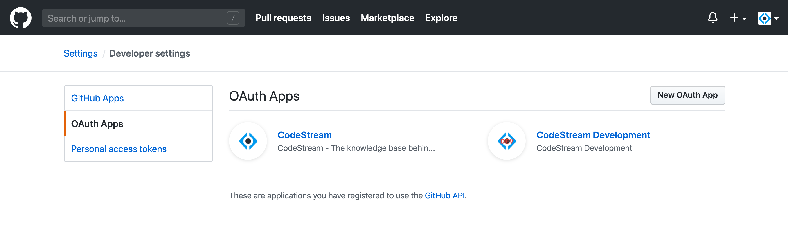
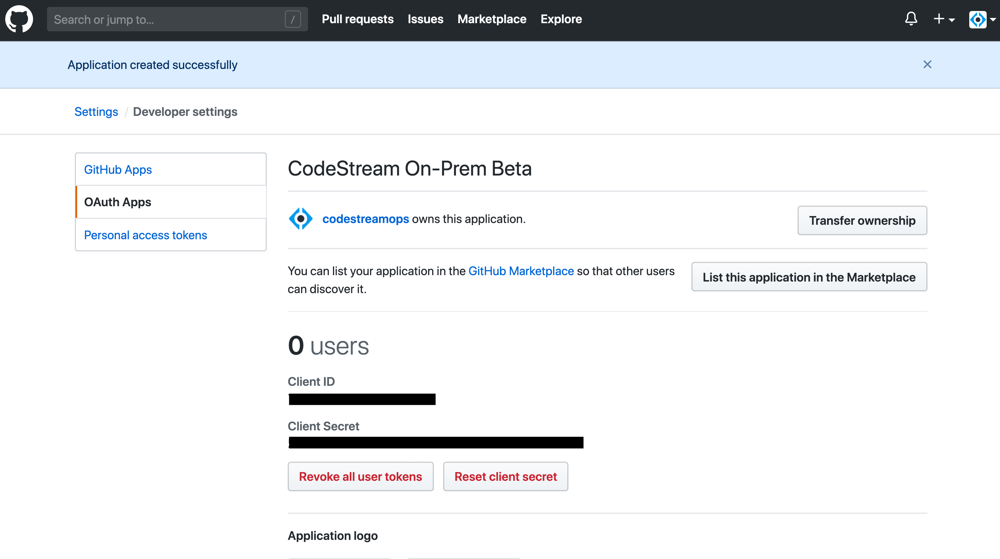

In order to integrate with Github.com you'll need to create an OAuth App which
will enable your CodeStream On-Prem server to use the Github REST APIs.

## Login to GitHub and Navigate to OAuth Apps

First [Login to GitHub](https://github.com), then go to your Settings page:

<br>

Then select **Developer Settings**

<br>

And finally **OAuth Apps**




## Register a new OAuth App

Press the **New OAuth App** button and complete the registeration form. Make
sure your callback URL references your company's CodeStream On-Prem hostname with
this path:
`https://codestream-onprem.mycompany.com/no-auth/provider-token/github`

<!-- <br> -->


Then press the **Register application** button.


## Update the CodeStream Config and Restart

After you register the application, click on it to expose the client ID and
client secret.



Then update your codestream config file,
**~/.codestream/codestream-services-config.json**, by adding the following
section.

```
	"integrations": {
		"github": {
			"cloud": {
				"appClientId": "-- Client ID goes here --",
				"appClientSecret": "-- Client Secret goes here --"
			}
		},
		...
	},
	...
```

After you make that change, restart CodeStream
```
~/.codestream/codestream --restart
```

Instruct your users to _Reload_ their IDEs. They should now be able to connect
to Github.
