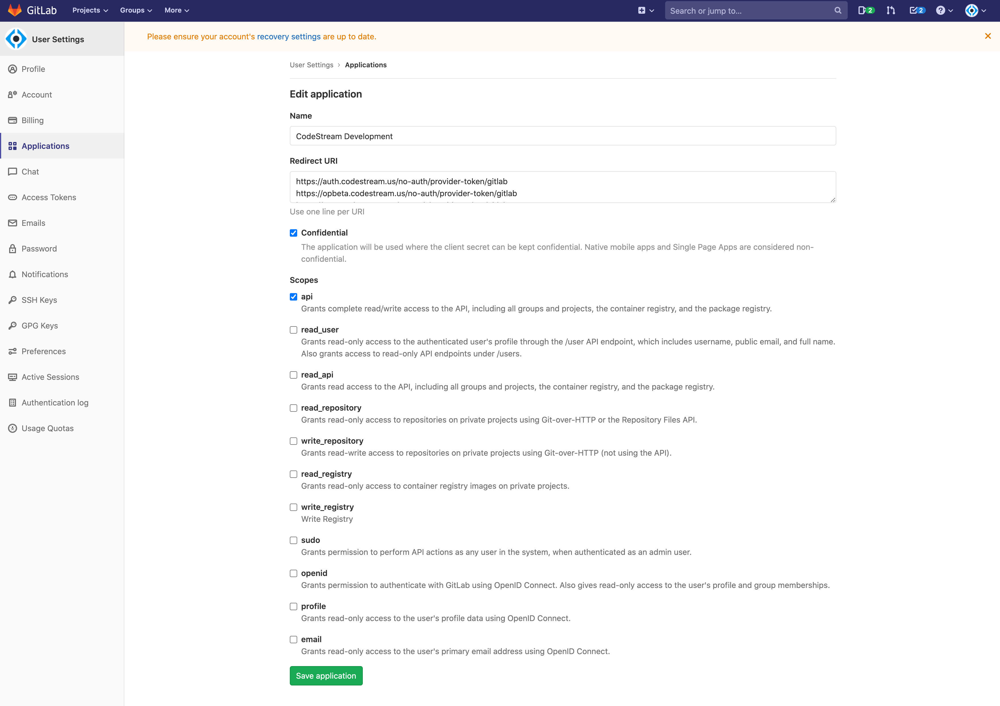
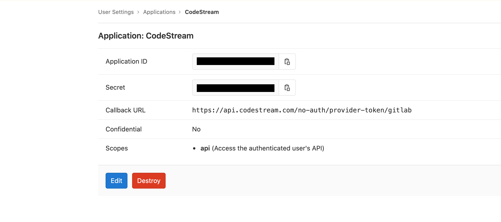

For the CodeStream Gitlab integration, you'll need to create a new Application
in your gitlab account to provide access to the Gitlab API.

## Login to Gitlab and Go to the Applications page

[Login to gitlab](https://gitlab.com), click the dropdown under your user icon
in the upper right and select **Settings**.


<br>

The select **Applications** on the left nav bar to expose the **New
Application** form.



## Create the Application

Complete the form pictured above. Make sure you check the **api** scope, and
optionally, the **Confidential** scope. The redirect URL should reference your
company's CodeStream On-Prem hostname with this path:
`https://codestream-onprem.mycompany.com/no-auth/provider-token/gitlab`

When you're done, click the **Save application** button.


## Update the CodeStream Config and Restart

After you create the application, click on it in the list to expose the
application ID and secret.



Then update your codestream config file,
**~/.codestream/codestream-services-config.json**, by adding the following
section.

```
	"integrations": {
		"gitlab": {
			"cloud": {
				"appClientId": "-- App ID goes here --",
				"appClientSecret": "-- Secret goes here --"
			}
		},
		...
	},
	...
```

After you make that change, restart CodeStream
```
~/.codestream/codestream --restart
```

Instruct your users to _Reload_ their IDEs. They should now be able to connect
to Gitlab.
