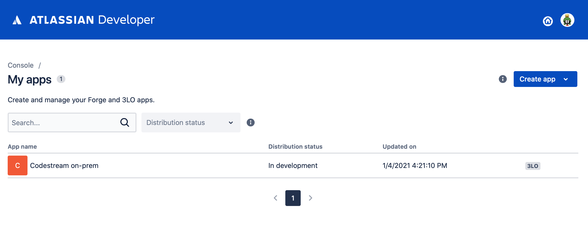
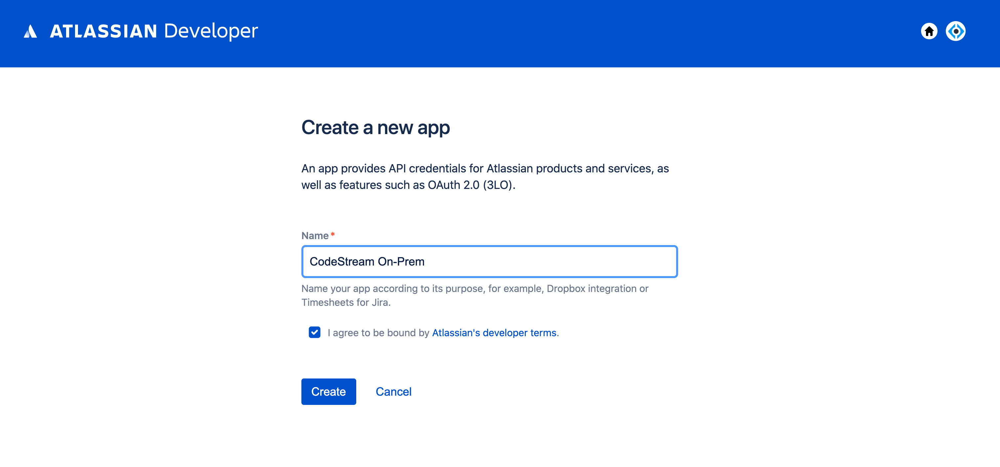
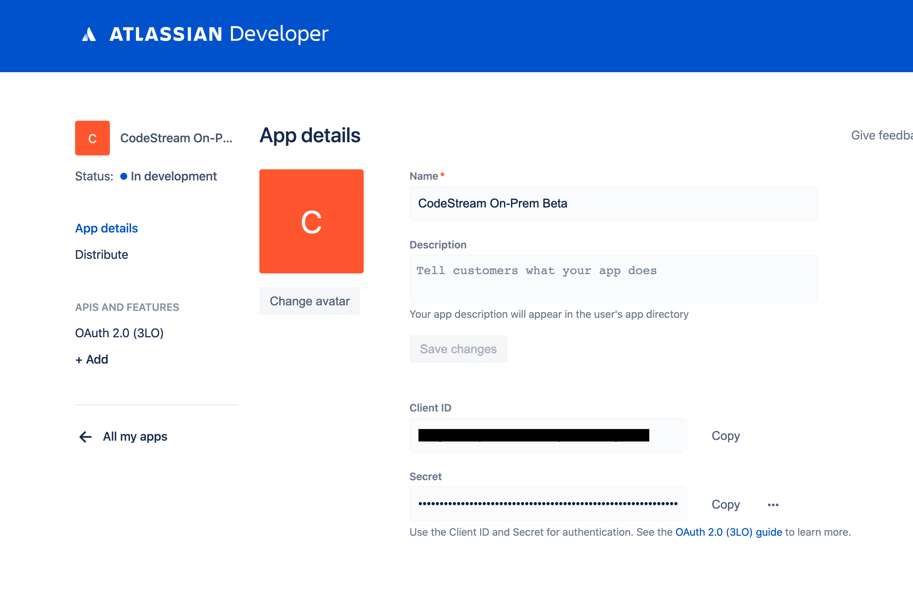
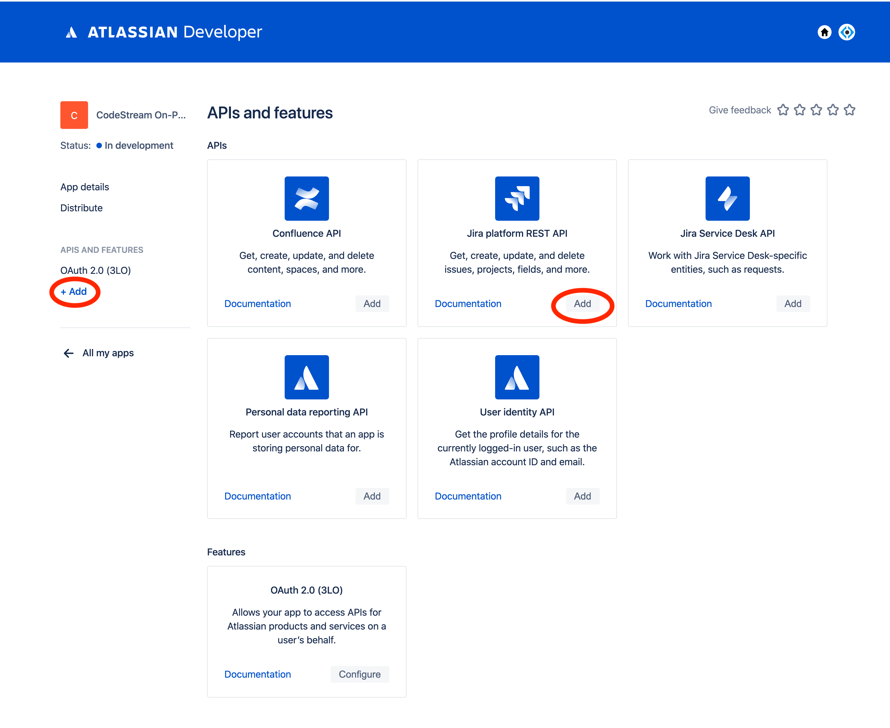
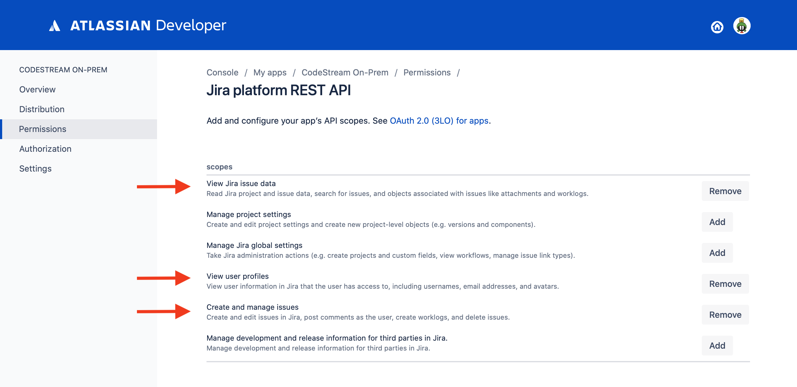
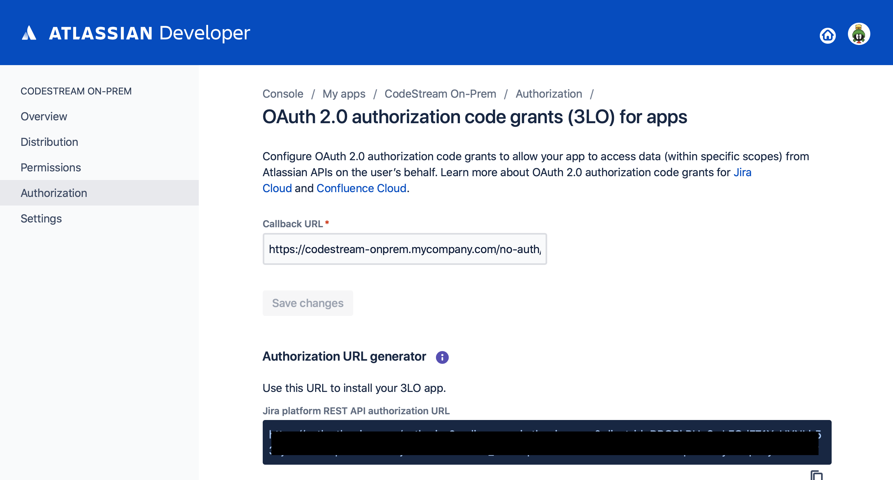
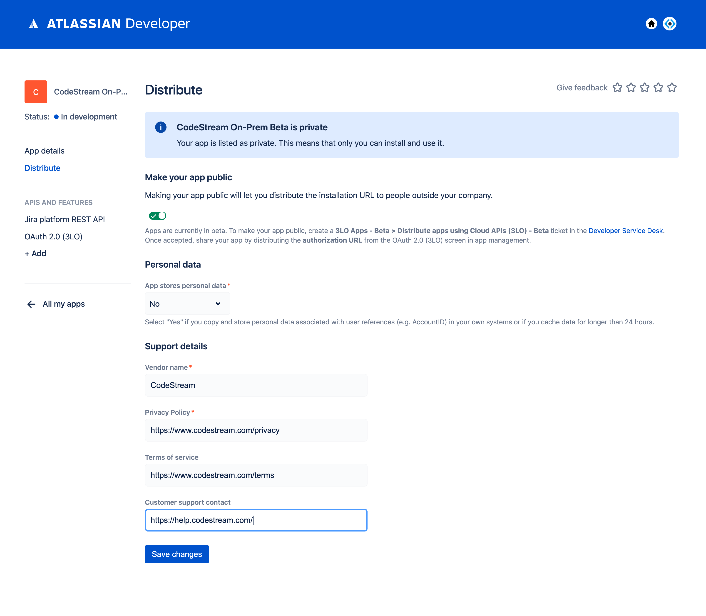

In order to integrate CodeStream with Jira on the Atlassian Cloud platform,
you'll need tp create a Developer App to provide credentials to use their REST
API.

## Login to Atlassian Cloud and Go to Developer Apps

[Login to Atlassian Cloud](https://atlassian.com) and once logged in, go to
[Developer Apps](https://developer.atlassian.com/apps).




## Create a new Application for CodeStream Access

Press the **Create new app** button, select an application name, for example
**CodeStream On-Prem**, and agree to the developer terms of service.



Once you press the **Create** button, you'll be placed on your newly created app's page.



Take note of the Client ID and Secret.


## Add your REST API Permissions and Callback URL

Select the **+ Add** link on the navagation bar to bring up the Feature options
page and add the **Jira REST Platform API** feature.



Select the **Jira platform REST API** option which now exists on the nav bar and
update the permissions to match this screen shot.



Now select **OAuth 2.0 (3LO)** on the left navagation bar and add your
callback URL. It should reference your company's CodeStream On-Prem hostname
with this path:
`https://codestream-onprem.mycompany.com/no-auth/provider-token/jira`




## Distribute the App

For anyone other than you to use the app, you must publicly distribute it.
Select the **Distribute** option on the nav bar, complete the form and make your
app publicly available.



## Update the CodeStream Config and Restart

Fnally, update your codestream config file,
**~/.codestream/codestream-services-config.json**, by adding the following
section using the Client ID and Secret from earlier.

```
	"integrations": {
		"jira": {
			"cloud": {
				"appClientId": "-- Client ID goes here --",
				"appClientSecret": "-- Secret goes here --"
			}
		},
		...
	},
	...
```

After you make that change, restart CodeStream
```
~/.codestream/codestream --restart
```

Instruct your users to _Reload_ their IDEs. They should now be able to connect
to Jira.
