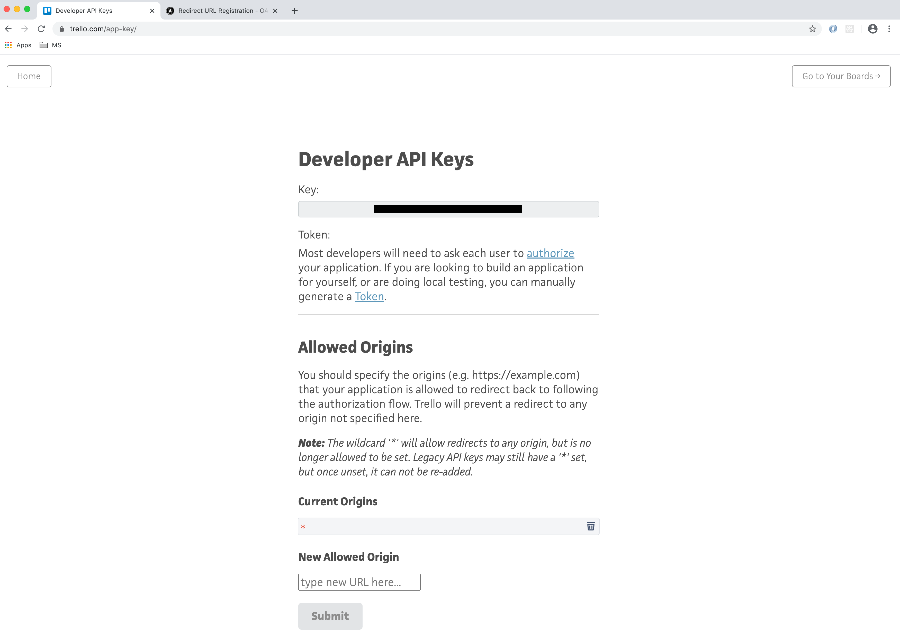

Configuring CodeStream to integrate with Trello is a bit different than the
other services. Trello provides a Developer API Key to all accounts. You cannot
change it.

## Login to Trello and Navigate to the Developer API Key Page

[Login to trello](https://trello.com) using the account whose Developer Key you
wish to use for integrating with CodeStream. Once you're logged in, you can see
your key by going to https://trello.com/app-key/ .



## Update the Origins

Add your CodeStream On-Prem server callback URL as a **New Allowed Origin**. The
redirect URL should reference your company's CodeStream On-Prem hostname with
this path:
`https://codestream-onprem.mycompany.com/no-auth/provider-token/trello`


## Update the CodeStream Config and Restart

Update your codestream config file,
**~/.codestream/codestream-services-config.json**, by adding the following
section.

```
	"integrations": {
		"trello": {
			"cloud": {
				"apiKey": "-- Developer Key goes here --"
			}
		},
		...
	},
	...
```

After you make that change, restart CodeStream
```
~/.codestream/codestream --restart
```

Instruct your users to _Reload_ their IDEs. They should now be able to connect
to Trello.
