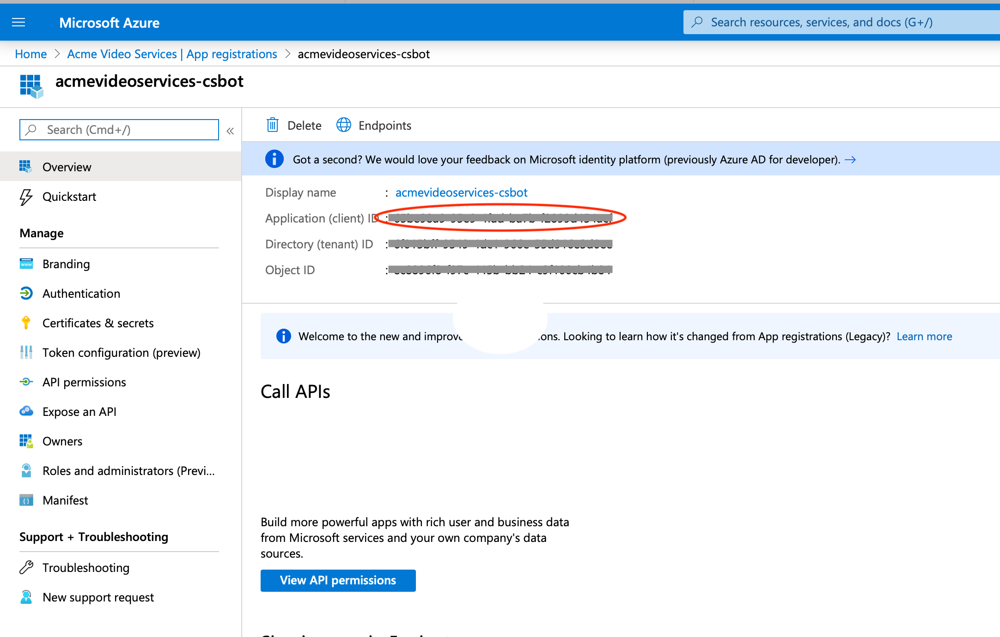
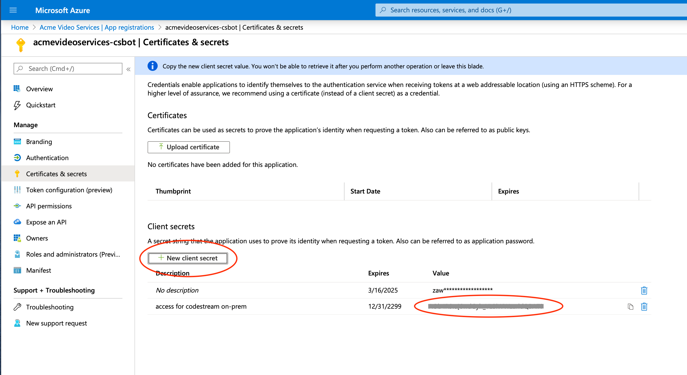
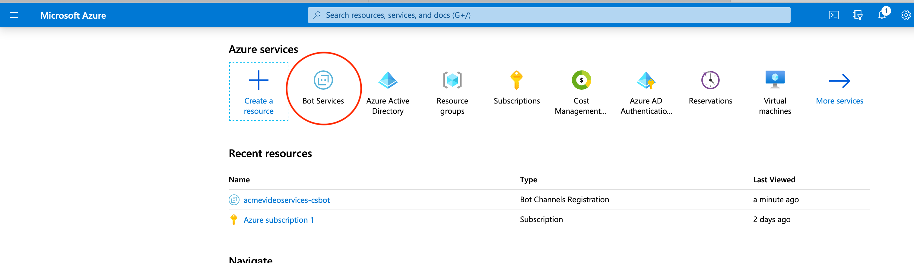
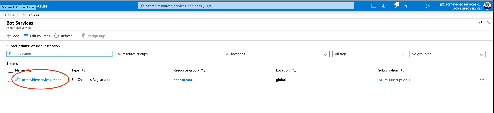
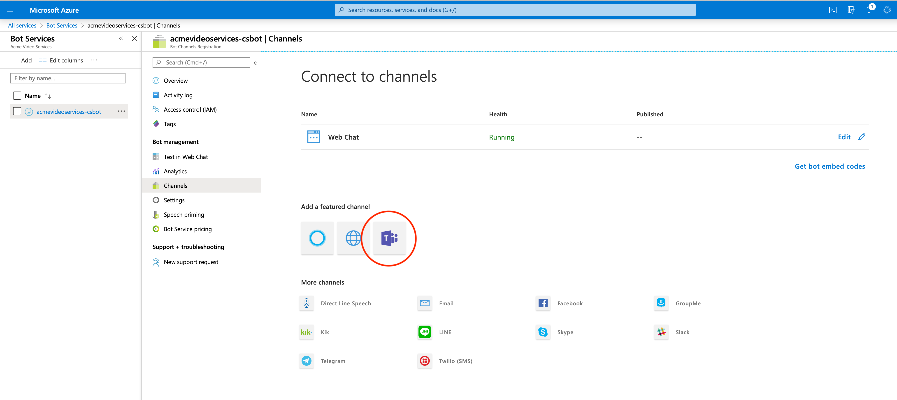
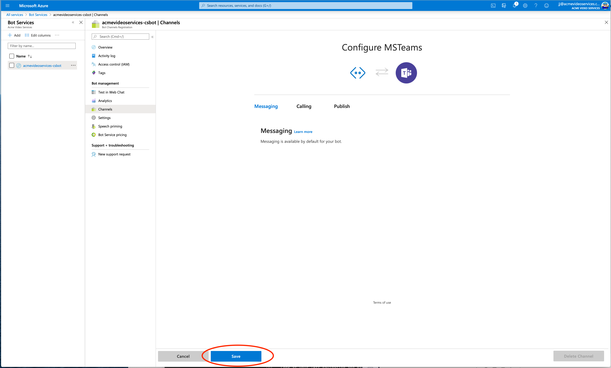
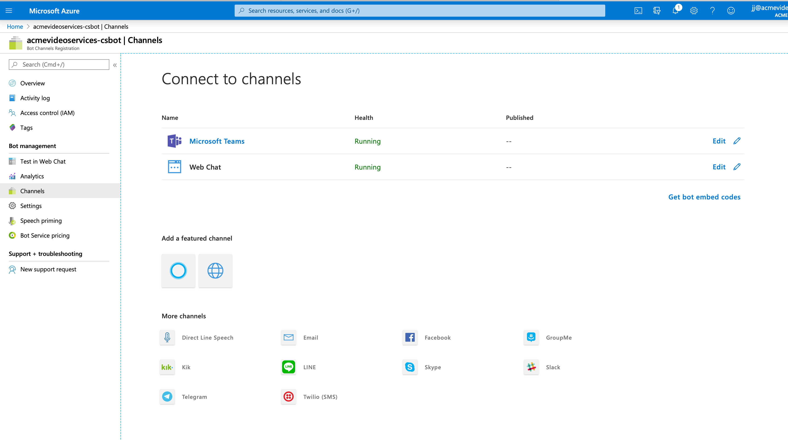
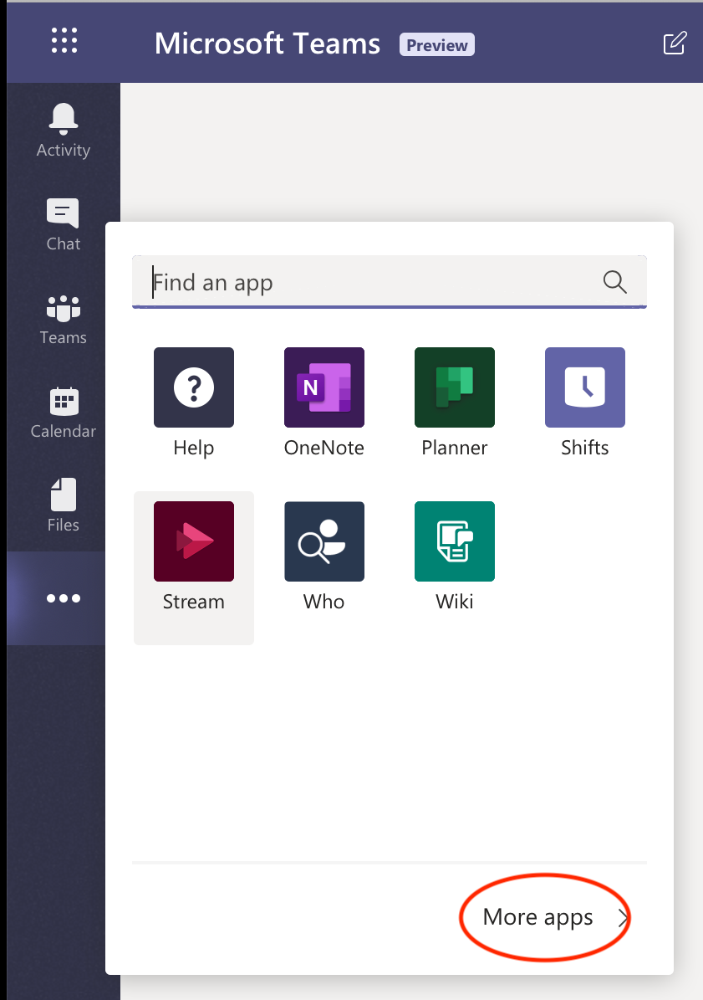
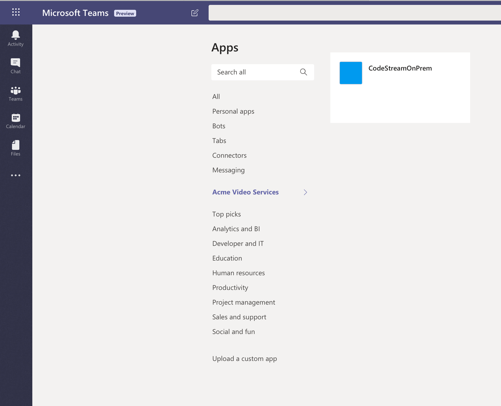

CodeStream's MST integration allows you to share your codemark comments inside
MS Teams channels. As the integration runs as a bot service, your CodeStream API
will need to get HTTPS requests made by Microsoft's Bot Channel Framework
connector service (requests coming _from_ microsoft). See the [network
configuration overview](network) page for more details on configuring your
network for this.

All requests made by the Microsoft Bot Connector Service are signed and verified
using the MS Bot Framework SDK to ensure authenticity.

You'll need an Azure AD account with permissions to create a Bot Channel
Registration resource as well as permissions in the MS Teams Office application
which allows for uploading a custom app (known as side-loading). The bot logic
exists as part of the CodeStream On-Prem API service and the Bot Channel
Registration you create on Azure provides the ID and password necessary for your
CodeStream API's bot service logic to connect and communciate with your MS Teams
channels.

For a more in-depth understanding of Microsoft's bot framework, we recommend
reading [this overview of the MS bot
framework](https://techcommunity.microsoft.com/t5/iis-support-blog/bot-components-roles-diagrams-overview/ba-p/393113)
and [more detail about managing IDs and
passwords](https://techcommunity.microsoft.com/t5/iis-support-blog/bot-channels-registration-where-is-the-secret-password-for-the/ba-p/1136905#).


## Prerequisite

Configure your network to route secure web requests to your CodeStream On-Prem
API service. [More details can be found here](network). You will need the public
facing, fully qualified hostname for your CodeStream API to complete the Bot
Channel Registration in Azure AD. For this document, we will assume it's
`bastion-host.my-company.com`.

## Create a Bot Channel Registration Resource in Azure AD
This must be completed by someone with privileges in the Azure Portal (for
example a Global Administrator).

By creating a Bot Channel Registration and connecting it to MS Teams, you will
be provided with an Application ID and Password (Secret) which you will use to
create an App Package and add to your CodeStream On-Prem configuration file.

You'll need the following:

* Choose a globally-unique name (bot handle) for your Bot Channel Registration.
* A subscription ID in the Azure account (MS will create a trial account with
  $200 worth of credits if you don't have one). Note that the bot does not cost
  any money.
* A resource group for the bot channel registration resource, though you can
  create a new one as you do this if you want.

Complete these steps in order:

1. Login to the [Azure Portal](https://portal.azure.com)
1. Hamburger Menu (upper left) > '+ Create a resource'
1. Search for the **bot channels registration** resource and press the Create button.

   

   

1. Complete the **bot channels registration** form and create the resource to
   become available.

   

   1. Choose a **Bot handle**. It must be globally unique.

   1. **Azure Subscription** - whomever manages your Azure AD can provide this
      to you. You won't get charged for this resource.

   1. **Resource Group** - select or create one.

   1. **Location** - this will determine where the resource resides.

   1. **Pricing Tier** - Use `S1` unless you have a reason not to.

   1. **Messaging Endpoint** - This is the publicly facing URL of your
      CodeStream On-Prem API service. If you created a proxy server as per the
      [network configuration overview](network) page, you'd use
      `https://bastion-host.my-company.com/no-auth/provider-action/msteams`.

   1. Turn **Application Insights** off

   1. Submit the form - **Create** button on the bottom - to submit the request
      to Azure. You'll be notified via the Azure Portal dashboard when your
      resource is ready (typically between 2 and 5 minutes).

1. Open your app's registration blade: Hamburger Menu > Azure Active
   Directory > App Registrations > _select your app_

1. The _Overview_ blade shows the **Application (client) ID**. This is the
   **App ID**, also referred to as the **Bot ID** or **client ID**. You will
   need this value.

   

1. Select _Certificates & Secrets_ under the _Manage_ section and create a new
   client secret (leave the one that's already there in place).

   

   _**Make sure you save the secret (password). You won't be able to retrieve
   it again.**_

1. In the Azure Portal, find the **Bot Services** section (use the search if
   need be) and click on your Bot Service.

   

   

1. Sekect the **Channels** blade and add MS Teams as a channel and click
   **Save**. You should now see MS Teams listed under **Connect to Channels**.

   

   

   
   

## Create a custom CodeStream App Package
The App Package is a zip file which contains a manifest that has the App ID you
just registered in it. When you install it into MS Teams as a custom app
(side-loading), it will connect your MS Teams channels with your CodeStream API
service.

From your CodeStream host OS (where the docker containers are running), execute
these commands to create your custom App Package (zip file). Specify the App ID
you got when completed your Bot Channel registration.

_NOTE: This requires the `zip` command be installed on your host OS._
```
~/.codestream/single-host-preview-install.sh --create-mst-app-package <app-id> <public-api-hostname>
# ex:  ./single-host-preview-install.sh --create-mst-app-package abcdefabc-9876-wxyz-abab-1020304050 bastion-host.my-company.com
```

Your newly created App Package is on your host OS as `~/.codestream/codestream-mst-app.zip`.


## Update the CodeStream Services configuration file

Next, add the App ID and Password to the CodeStream On-Prem configuration file,
`~/.codestream/codestream-services-config.json`.

1. Backup the config file.
   ```
   cp ~/.codestream/codestream-services-config.json ~/.codestream/codestream-services-config.json.backup
   ```

1. Use an editor to update (or add) the `integrations` section with the
   following properties:
   ```
   {
      ...
      "integrations": {
         "msteams": {
            "microsoft.com": {
               "botAppId": "<app-id>",
               "botAppPassword": "<secret-password>"
            }
         }
      },
      ...
   }
   ```

1. Restart the CodeStream services (not including mongo)
   ```
   ~/.codestream/single-host-preview-install.sh -M -a restart
   ```

### Side-load the CodeStream App Package into MS Teams
This requires Admin privileges within MS Teams.

Go to the Office 365 MS Teams application, select the ellipsis (...) and then _More apps_. 



Look at your left navigation and make sure you have the _Upload a custom app_
link at the bottom. This requires privileges. If you don't see it, you need to
talk to your Office / Teams administrator.


Select _Upload a custom app_ and upload the zip file (app package) you created
in the prior step. When you're done, you should see this.



The CodeStream Bot App is now available for users to add to their channels or
teams and to sign-in and connect to your CodeStream API.

[Instructions for individuals to setup and connect to the bot service can be
found here](https://docs.codestream.com/userguide/features/msteams-integration/).
