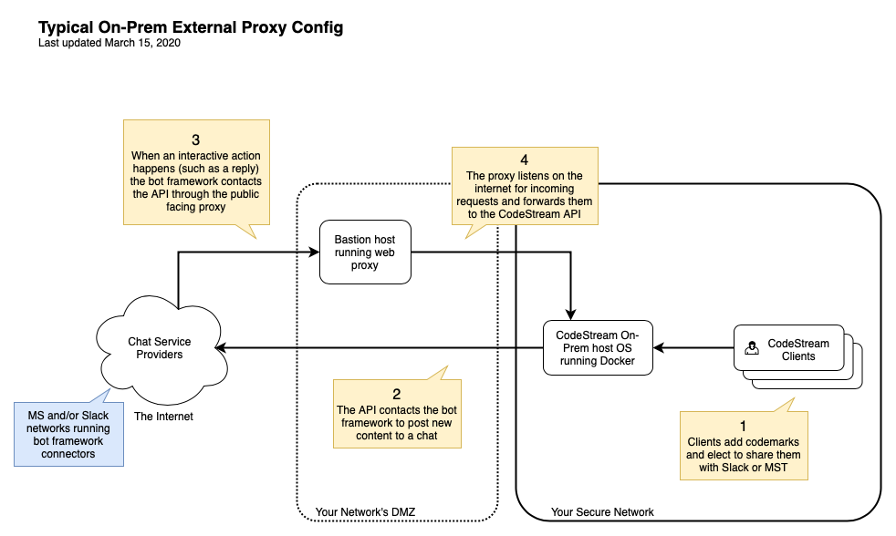

Integrations with messaging services such as Slack and MS Teams provide more
functionality than those for issue tracking services such as Trello and Jira.
The message service providers' frameworks incorporate connectors running on
their networks which will make secure web requests (via HTTPS) to your
CodeStream On-Prem API service where the logic resides.

For this to work your network will have to be configured to allow specific web
requests made from the service provider(s), Microsoft and/or Slack, to be routed
through to your CodeStream API. All requests are signed and authenticated so any
malicious traffic to the CodeStream API will simply be dropped.

The configuration of your network for this purpose is beyond the scope of these
instructions but we've provided an overview of a typical configuration to
illustrate the concepts. We've also provided an example configuration that could
be used for configuring [Nginx](http://nginx.org/) as a secure web proxy running
on a basiton host.

**_NOTE:_** _The Slack integration can be used without exposing your CodeStream
On-Prem API to the internet, but you will have limited functionality in that
replies from inside of Slack won't work. If this is what you want, you can
proceed directly to the Slack-specific setup instructions._


## Typical Request Flow
Diagram of the messaging intergration request flow.




## Bastion Host Configuration

This host runs a proxy web server, such as Nginx, which listens for secure
requests on a public internet-facing interface (IP address) to forward to your
CodeStream API service.

Requirements include:

1.  A publicly routable IP address associated with one of its interfaces.

1.  A publicly resolvable, fully qualified hostname (which includes a domain
    name), such as `bastion-host.my-company.com`, whhich resolves to the
    routable IP address. This hostname does not need to match your CodeStream
    On-Prem hostname but you will be adding it to the codestream configuration
    file.

1.  A valid SSL certificate matching the fully qualified hostname (or domain
    name in the case of a wildcard certificate) of the bastion hast. It must
    come from a recognized Certificate Authority. It cannot be self-signed.

In short, Microsoft and/or Slack's bot framework connectors must be able to
properly resolve the `bastion-host.my-company.com` hostname in DNS and route
valid _HTTPS_ requests to it, expecting to be talking to the CodeStream Bot
(which is embedded in the CodeStream API).


### Example Nginx Configuration

Here's an example of an nginx host-based configuration that would perform as a
proxy for HTTPS traffic coming in on port 443 (the standard HTTPS port). It only
exposes the CodeStream API's Slack and MST bot logic.

```
server {
    listen 443 ssl;
    server_name bastion-host.my-company.com;
    access_log /var/log/nginx/csproxy.access.log main;
    error_log /var/log/nginx/csproxy.error.log;

    # These two files are the SSL Certificate files associated with
    # your bastion host; bastion-host.my-company.com.
    ssl_certificate /path/to/full/cert/chain/my-certificate-chain.pem;
    ssl_certificate_key /path/to/cert/key/my-certificate-key.pem;

    # requests from Slack's Bot Framework are proxied to the CodeStream API
    location /no-auth/provider-action/slack) {
        resolver 8.8.8.8;   # replace with ip of your host's resolver IP
        proxy_set_header Host codestream.my-company.com;
        proxy_pass https://codestream.my-company.com/no-auth/provider-action/slack;
    }

    # requests from MST's Bot Framework are proxied to the CodeStream API
    location /no-auth/provider-action/msteams) {
        resolver 8.8.8.8;   # replace with ip of your host's resolver IP
        proxy_set_header Host codestream.my-company.com;
        proxy_pass https://codestream.my-company.com/no-auth/provider-action/msteams;
    }

    # All other requests get ignored with 404
    location / {
        return 404;
    }
}
```

## Test Your Proxy Configuration

Once the proxy is properly configured, you should be able to make the following requests successfully in your web browser.

* `https://bastion-host.my-company.com/no-auth/provider-action/slack/`
* `https://bastion-host.my-company.com/no-auth/provider-action/msteams/`

They will fail but they should also reach your API and return the following error:
```
Cannot GET /no-auth/provider-action/msteams
```

## Setup the Integration with the Messaging Service Provider

Continue with the provider-specific configuration on the follow pages.
