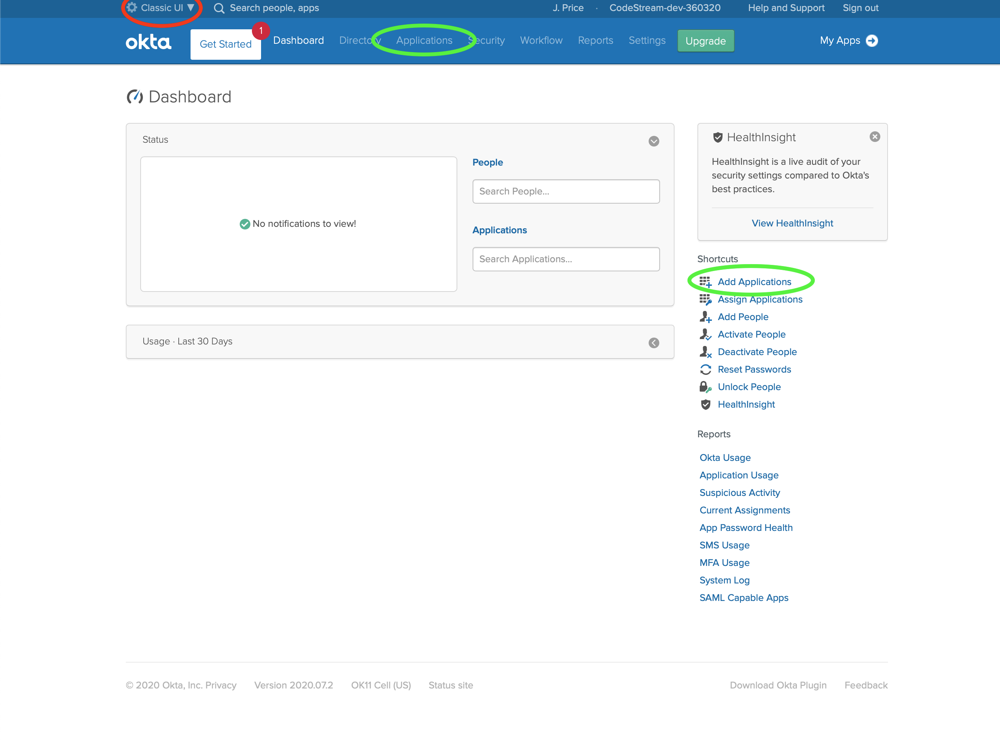
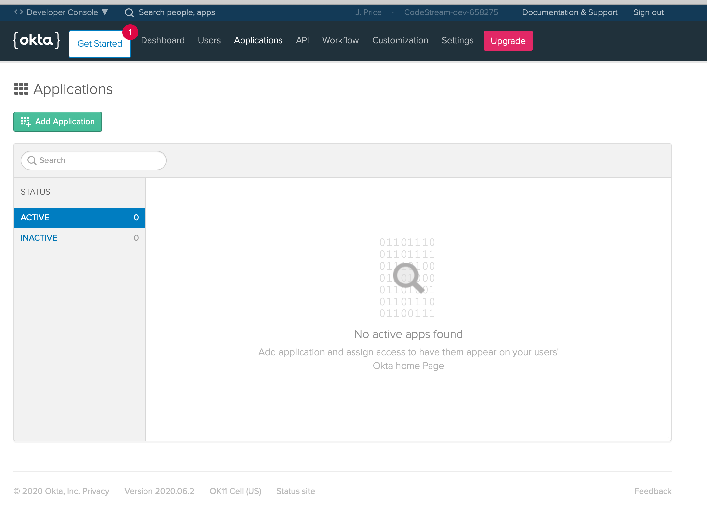
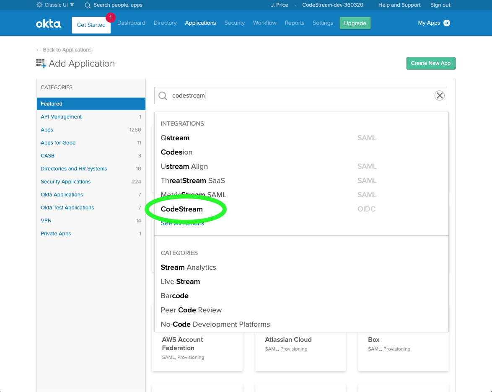
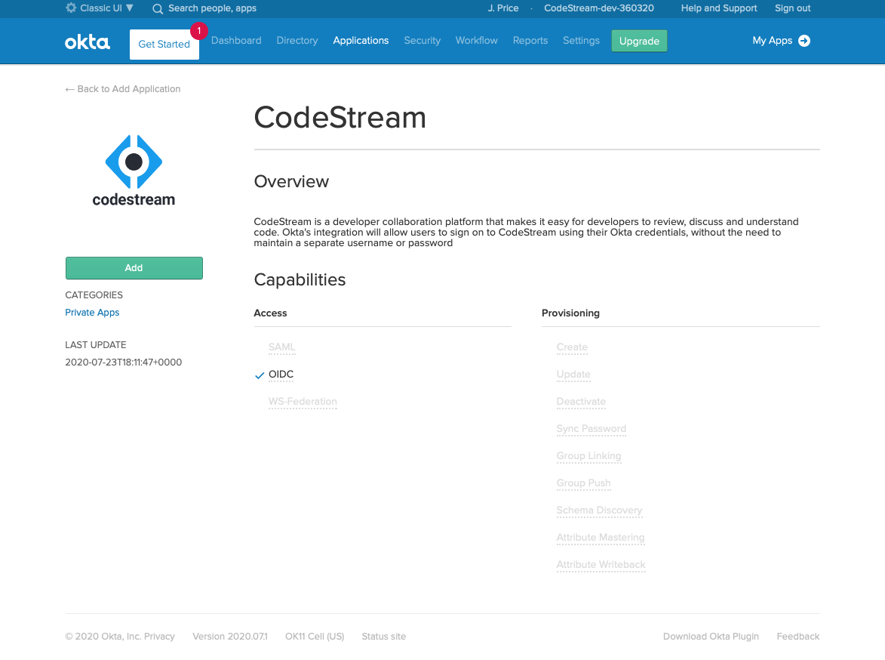
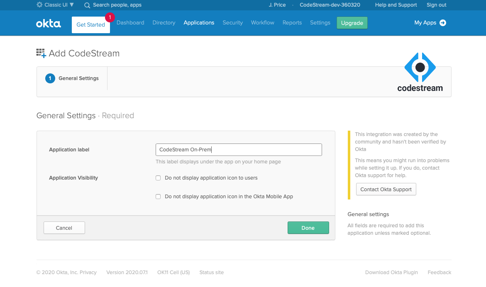
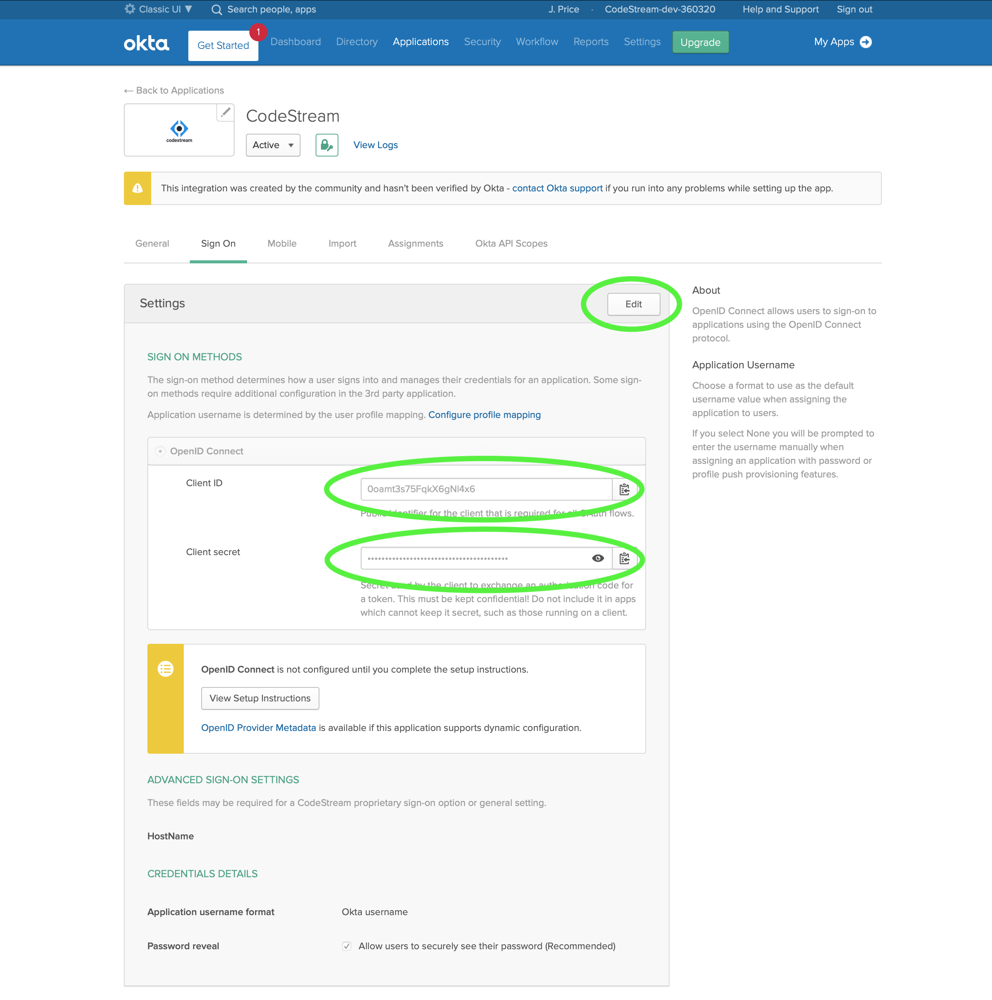
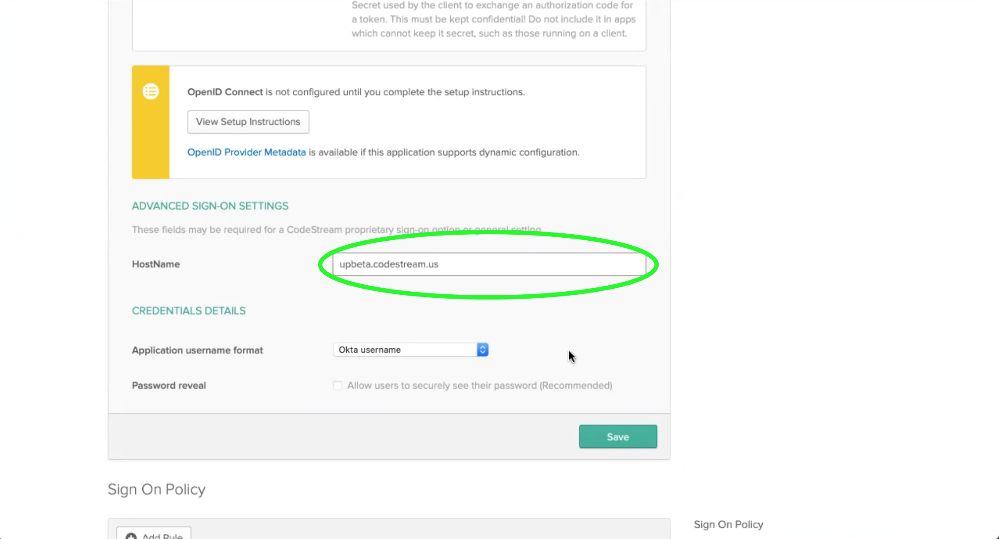
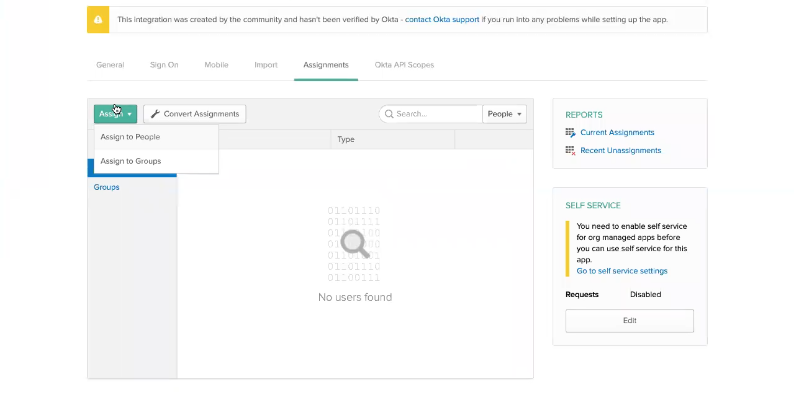
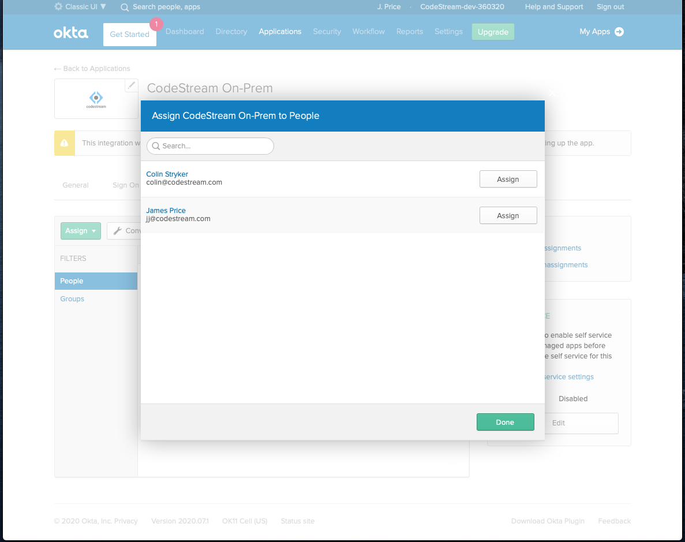

CodeStream now supports Okta's consolidated single sign-on service for
authentication as well. To get it running, you'll need to set up an Okta Web
Application for CodeStream's OAuth process. Simply follow the instructions
below.

## Login to your Okta Admin Portal

Sign-in to your Okta console with an Administrator account. On the Dashboard,
select the Classic UI interface (red oval).




## Go to the Applications pane to Add an Application

Go to the Applications panel by clicking on **Applications** on the top nav bar
or **Add Applications** on the right nav bar (green ovals). Then press the
green **Add Application** button.




## Add the CodeStream Application

Type **codestream** in the search bar and select the CodeStream app.



Then click the green **Add** button on the CodeStream app page.




## Give the App a name

Give the App a name, for example **CodeStream On-Prem**, and press the
**Done** button.




## Record the App Client ID and Secret

With the new app selected, go to the **Sign-On** pane. Make note of the **Client
ID** and **Client Secret** which you will add to the CodeStream configuration
file in a later step (green circles).

Then click the **Edit** button to the right of settings (red circle).




## Add your CodeStream API hostname

Once you've clicked **Edit**, scroll down and fill in the **HostName** property
in the _Advanced Sign-On Settings_ section.  This should be the fully qualified
public-facing host name (without any protocol scheme or other URL properties) of
your on-prem CodeStream API server.

After you've entered the host name, click the green **Save** button.




## Assign persons to the CodeStream App

Now go to the **Assignments** pane and click the green **Assign** button.



Then add all the users and/or groups you want to allow to authenticate
CodeStream with Okta and click the green **Done** button.




## Update the CodeStream Config and Restart

Finally, Add the following section to your
**~/.codestream/codestream-services-config.json** file use the Client ID and
Client Secret you took note of in a previous step. Make a backup of this file
_before_ you add the new information, just in case something goes wrong you'll
be able to back out your change by putting the backup in place.
```
	"integrations": {
		"okta": {
			"localInstallation": {
				"appClientId": "-- Client ID goes here --",
				"appClientSecret": "-- Client Secret goes here --"
			}
		},
		...
	},
	...
```

After you make that change, restart CodeStream
```
~/.codestream/codestream --restart
```

Instruct your users to _Reload_ their IDEs. They should now be able to
authenticate with Okta.
