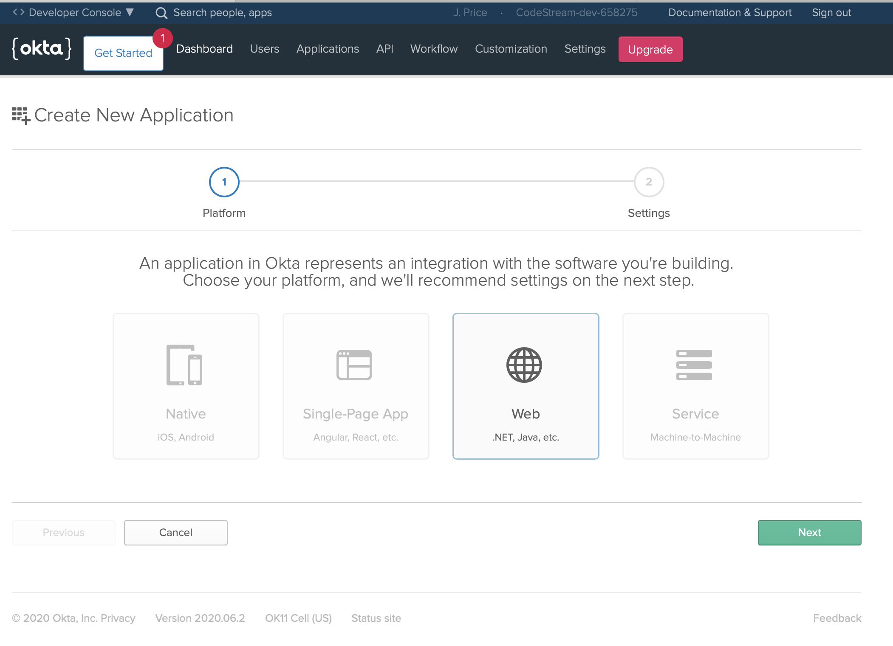
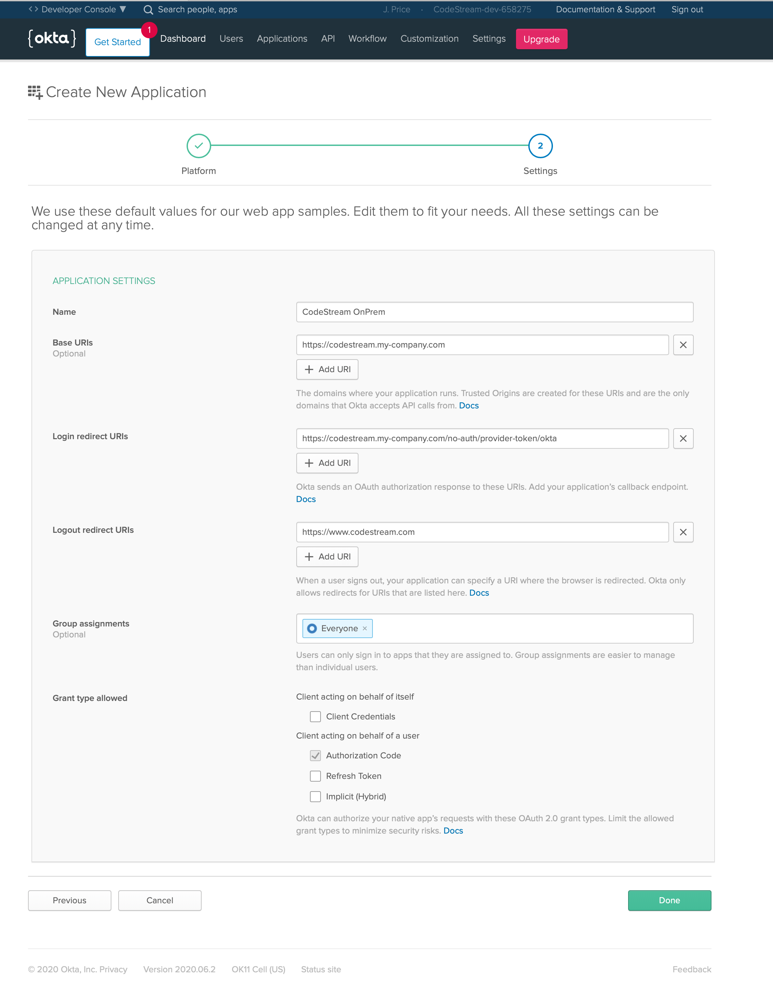
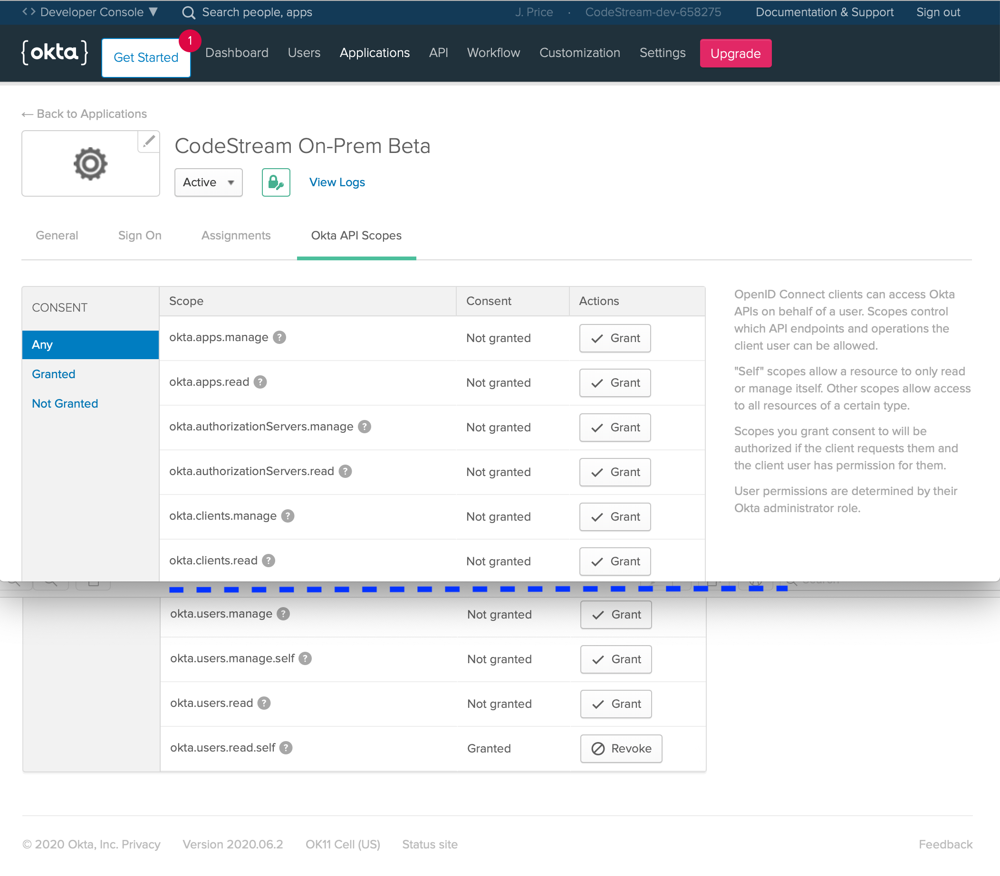
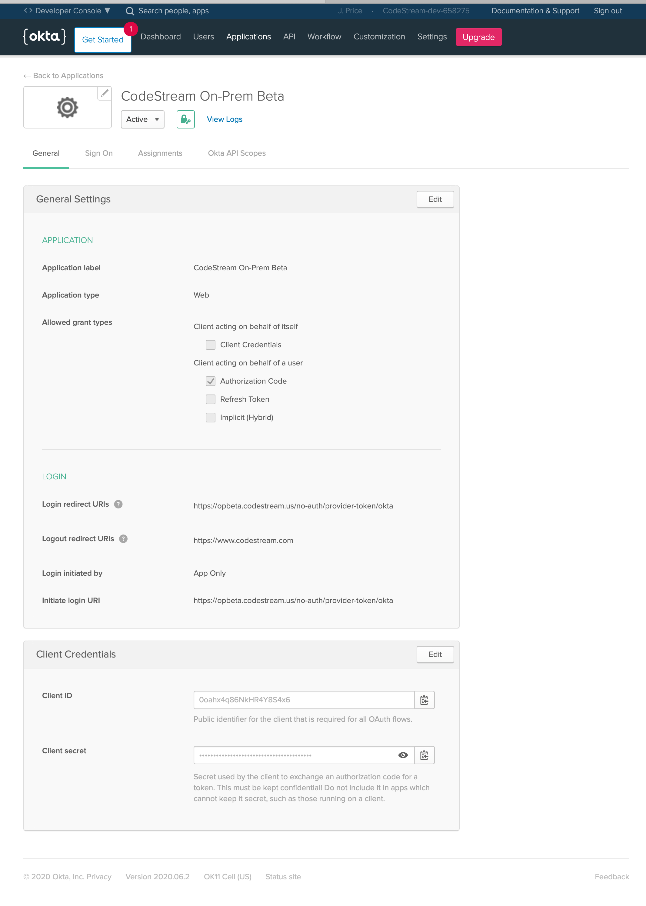

CodeStream now supports Okta's consolidated single sign-on service for
authentication as well. To get it running, you'll need to set up an Okta Web
Application for CodeStream's OAuth process. Simply follow the instructions
below.

## Login to your Okta Developer Edition Admin Console

Sign-in to your admin console. If you don't already have one, you can create
one for free by going to https://developer.okta.com/ and creating a free
account.  Once logged in, select the **Applications** tab.


## Create A Web Application for CodeStream Authentication

Click the **Add Application** button, then select the **Web** option and click
on the **Next** button.



Complete the form as pictured below using your own CodeStream On-Prem's
installation URLs and press **Done**.




## Grant Scopes

On the **Okta API Scopes** tab, towards the bottom of the page, **grant the
okta.users.read.self** scope.




## Take Note of the App's Client ID and Secret

Finally, on the App's **Gerenal** tab, take note of the **Client Id** and
**Client Secret** which appear towards the bottom of the page.




## Update the CodeStream Config and Restart

Add the following section to your
**~/.codestream/codestream-services-config.json** file. Make a backup of this
file _before_ you add the new information, just in case something goes wrong
you'll be able to back out your change by putting the backup in place.
```
	"integrations": {
		"okta": {
			"localInstallation": {
				"appClientId": "-- Client ID goes here --",
				"appClientSecret": "-- Client Secret goes here --"
			}
		},
		...
	},
	...
```

After you make that change, restart CodeStream
```
~/.codestream/codestream --restart
```

Instruct your users to _Reload_ their IDEs. They should now be able to
authenticate with Okta.
